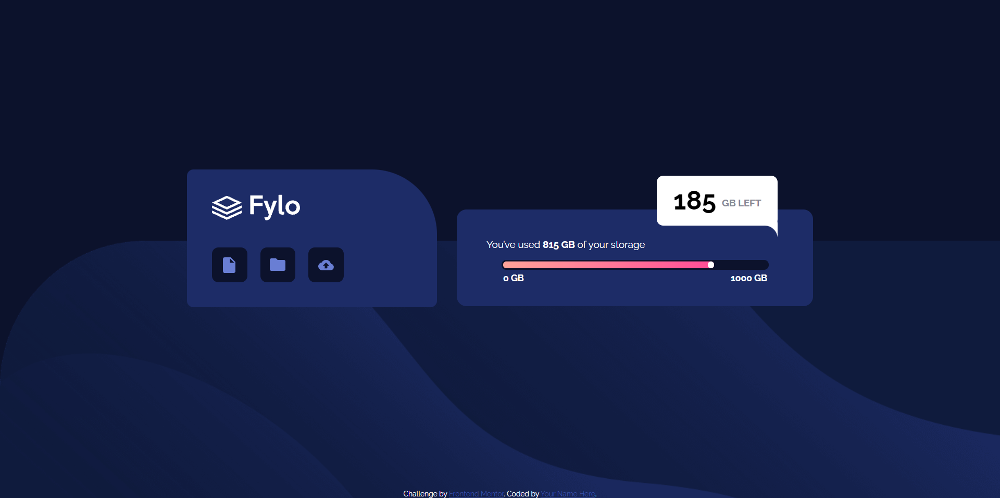
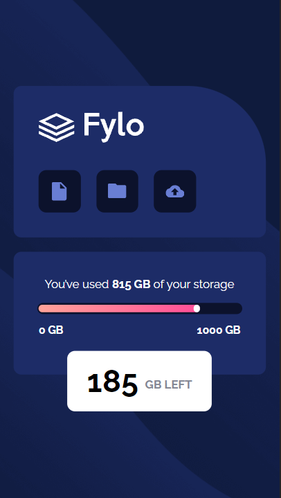

# Frontend Mentor - Fylo data storage component solution

This is a solution to the [Fylo data storage component challenge on Frontend Mentor](https://www.frontendmentor.io/challenges/fylo-data-storage-component-1dZPRbV5n). Frontend Mentor challenges help you improve your coding skills by building realistic projects. 

## Table of contents

- [Overview](#overview)
  - [The challenge](#the-challenge)
  - [Screenshot](#screenshot)
  - [Links](#links)
- [My process](#my-process)
  - [Built with](#built-with)
  - [What I learned](#what-i-learned)
  - [Continued development](#continued-development)
  - [Useful resources](#useful-resources)
- [Author](#author)
- [Acknowledgments](#acknowledgments)

**Note: Delete this note and update the table of contents based on what sections you keep.**

## Overview

### The challenge

Users should be able to:

- View the optimal layout for the site depending on their device's screen size

### Screenshot

### Links

- Solution URL: [Add solution URL here](https://www.frontendmentor.io/solutions/fylo-data-storage-component-with-html-and-css-YPvWkm7xv)
- Live Site URL: [Add live site URL here](https://lizanette.github.io/Fylo-data-storage-component/)

## My process

### Built with

- HTML5 markup
- CSS custom properties
## Author

- Website - [Lizanette](https://lizanette.github.io/NewCV/)
- Frontend Mentor - [@lizanette](https://www.frontendmentor.io/profile/lizanette)

## Acknowledgments

Huge shoutout to all the YouTube community that gives free advice and help in all kinds of topics, especially in HTML and CSS grid.
